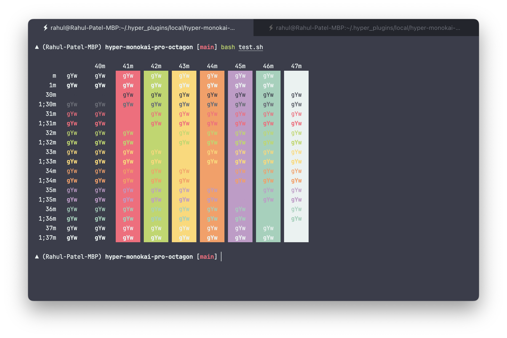

# Monokai Pro (filter Octagon) for [Hyper](https://hyper.is)

> [Monokai Pro (filter Octagon)](https://monokai.pro/) theme for [Hyper](https://hyper.is).

## Install

Add `hyper-monokai-pro-octagon` to the `plugins` array in your hyper config.

## Tips

The screenshot shown is a combination of the following additional software:

- [Oh My Zsh](https://github.com/robbyrussell/oh-my-zsh)
- [Vercel Zsh Theme](https://github.com/vercel/zsh-theme)
- [JetBrain Mono Font](https://www.jetbrains.com/lp/mono/)

## License

[MIT License](./LICENSE)
